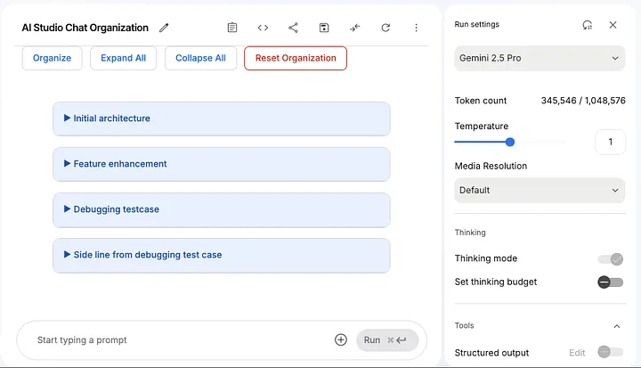

# AI Studio Organizer

An unofficial browser extension to supercharge Google's AI Studio with powerful chat organization features. Group conversations, create persistent workspaces, and streamline your workflow.

  
*(Recommendation: Take a screenshot of the extension working, upload it to a site like Imgur, and replace the URL above)*

---

## Features

-   **Group & Minimize:** Select multiple chats and collapse them into a single, named group.
-   **Persistent Workspaces:** Your created groups are saved *per conversation*, so your organized layout is restored automatically when you reopen a saved prompt.
-   **Range Selection:** Quickly select a continuous block of chats by clicking a start point and an end point.
-   **Group Management:**
    -   Expand or collapse all groups at once.
    -   Rename groups at any time.
    -   Un-organize a group to return chats to the main list.
    -   Remove a group from your view.
-   **Download Conversations:** Export the full text of any group into a clean `.txt` file.
-   **Adaptive Theming:** A polished UI that automatically adapts to both AI Studio's light and dark modes.

## Installation

Since this extension is not on the Chrome Web Store, you can load it locally in Developer Mode.

1.  **Download the Project:** Click the green "Code" button on this GitHub page and select **"Download ZIP"**.
2.  **Unzip the File:** Unzip the downloaded file. You should now have a folder named `ai-studio-organizer-main` (or similar).
3.  **Open Chrome Extensions:** Open Google Chrome, type `chrome://extensions` in the address bar, and press Enter.
4.  **Enable Developer Mode:** In the top-right corner, turn ON the **"Developer mode"** toggle.
5.  **Load the Extension:** Click the **"Load unpacked"** button that appears.
6.  **Select the Folder:** In the file dialog, select the `ai-studio-organizer-main` folder and click "Select Folder".

The "AI Studio Organizer" extension will now appear in your list and is ready to use.

## How to Use

1.  **Save Your Chat:** For persistence to work, you must first be working on a **saved** prompt in AI Studio (one that has a unique URL like `/prompts/your-prompt-id`).
2.  **Enter Organize Mode:** Click the **"Organize"** button in the top toolbar. The button will turn red.
3.  **Select a Range:**
    -   Click your desired **starting chat**. It will be highlighted.
    -   Click your desired **ending chat**. The entire block in between will be selected.
4.  **Create a Group:** Click the green **"Group X Chat(s)"** button.
5.  **Name It:** Enter a name in the pop-up and click "OK". Your group is now created, minimized, and saved.
6.  **Manage:** Hover over the group header to see options for Downloading, Renaming, Un-organizing, or Deleting the group from your view.

## Upcoming Features (Future Roadmap)

This extension is actively being developed. The grouping architecture we've built is a foundation for even more powerful AI-assisted features. Here is a glimpse of what's planned for the future:

-   **AI-Powered Summarization:** Right-click a group and select "Summarize with AI" to get a concise summary of that entire line of investigation.
-   **Conversation Optimization:** An intelligent tool to detect repetitive or redundant text within a group and offer to automatically "condense" it, saving tokens and improving clarity.
-   **Export to Markdown:** In addition to `.txt`, an option to download a group formatted as a clean Markdown file, preserving code blocks and formatting.

Have an idea for a feature? Feel free to suggest it in the "Issues" tab!

## Contributing

Contributions are welcome! The most common point of failure is when Google updates the AI Studio website, which can break the CSS selectors.

-   `TOOLBAR_SELECTOR`: The element where the main buttons are injected.
-   `CHAT_TURN_SELECTOR`: The element for an individual chat bubble.
-   `CHAT_CONTAINER_SELECTOR`: The parent element that holds all the chats.

If the extension breaks, updating these constants in `organizer.js` is the first place to look. Feel free to open an issue or submit a pull request!

## License

This project is licensed under the MIT License. See the [LICENSE](LICENSE) file for details.